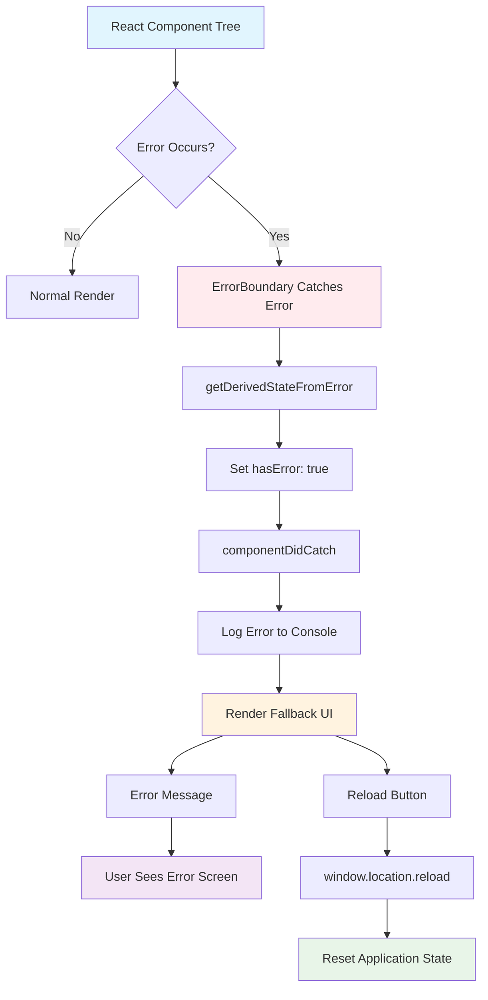

# Diagram działania ErrorBoundary

## Jak działa ErrorBoundary:

### Kluczowe metody:

1. **getDerivedStateFromError()**
   - Wywoływana po błędzie w komponencie potomnym
   - Aktualizuje stan ErrorBoundary
   - Zwraca nowy stan lub null

2. **componentDidCatch()**
   - Wywoływana po błędzie
   - Loguje błędy do konsoli
   - Może wykonywać side effects

### Przepływ działania:

1. **Normalne działanie** - ErrorBoundary renderuje dzieci
2. **Błąd w komponencie** - ErrorBoundary łapie błąd
3. **Aktualizacja stanu** - hasError = true
4. **Logowanie** - błąd zapisywany do konsoli
5. **Fallback UI** - wyświetlany zamiast zawieszonego komponentu
6. **Opcja resetu** - użytkownik może przeładować aplikację

### W naszej aplikacji:

- **ErrorBoundary** otacza całą aplikację
- **Przycisk "Throw Error"** celowo rzuca błąd do testowania
- **Fallback UI** pokazuje przyjazny komunikat
- **Przycisk "Reload"** resetuje aplikację

### Ograniczenia ErrorBoundary:

- Łapie tylko błędy w komponentach React
- Nie łapie błędów w event handlers (dlatego używamy `shouldThrowError` w render)
- Nie łapie błędów asynchronicznych (promises, setTimeout)
- Nie łapie błędów w samej ErrorBoundary
