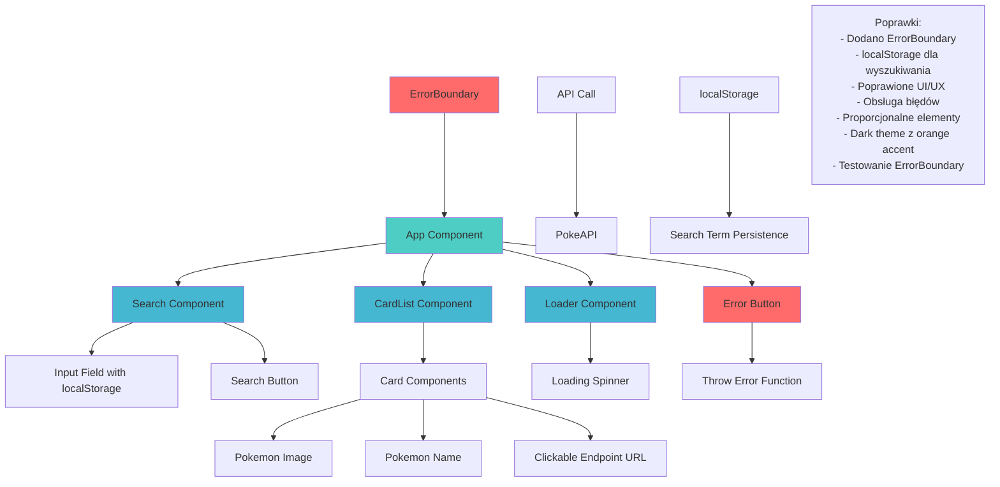

# Diagram stanu PO poprawkach

## Poprawki po implementacji:

1. **ErrorBoundary** - aplikacja jest zabezpieczona przed błędami
2. **localStorage** - wyszukiwania są zapisywane i przywracane
3. **Poprawione UI** - proporcjonalne elementy, dark theme, orange accent
4. **Obsługa błędów** - fallback UI z przyjaznym komunikatem
5. **Testowanie ErrorBoundary** - przycisk do celowego rzucania błędów
6. **Lepsze UX** - hover effects, zebra striping, clickable URLs
7. **Responsive design** - aplikacja działa na różnych rozmiarach ekranu
