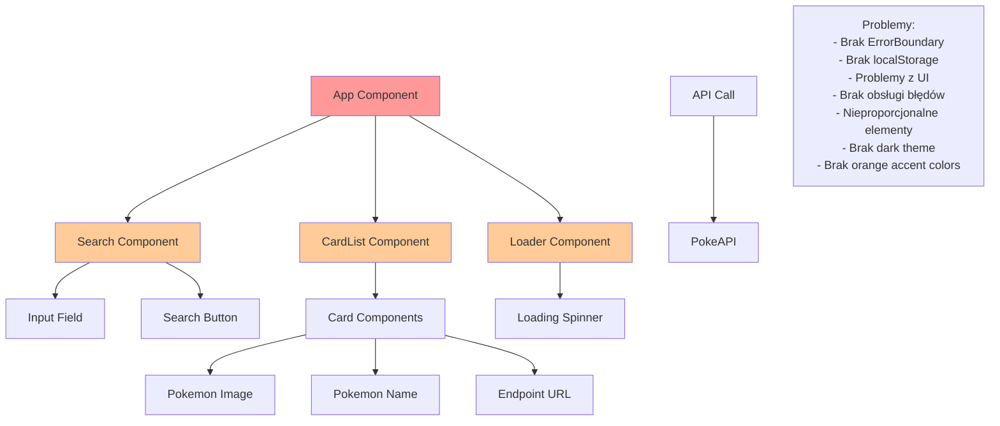

# Diagram stanu PRZED poprawkami

## Problemy przed poprawkami:

1. **Brak ErrorBoundary** - aplikacja mogła się zawiesić przy błędach
2. **Brak localStorage** - wyszukiwania nie były zapisywane
3. **Problemy z UI** - nieproporcjonalne ikony, nakładające się elementy
4. **Brak obsługi błędów** - nie było fallback UI
5. **Brak stylowania** - nie było dark theme ani orange accent
6. **Brak testowania ErrorBoundary** - nie było sposobu na przetestowanie obsługi błędów
